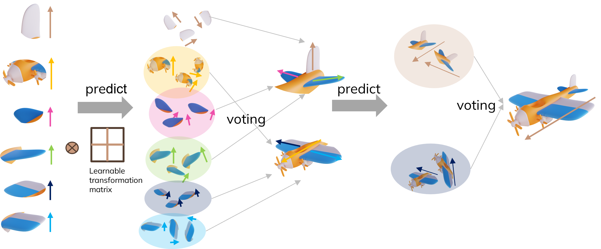

# Awesome Capsule Network 
A curated list of awesome Capsule Network works

## Table of Contents

- [Awesome Capsule Network ](#awesome-capsule-network-)
  - [Table of Contents](#table-of-contents)
  - [Survey \& News](#survey--news)
  - [Papers](#papers)
  - [Tutorials](#tutorials)
  - [Brief comparision](#brief-comparision)
  - [Implementations](#implementations)
    - [Tensorflow](#tensorflow)
    - [PyTorch](#pytorch)
- [Awesome](#awesome)
- [License](#license)

## Survey & News

- [Learning with Capsules: A Comprehensive Survey](https://arxiv.org/pdf/2206.02664.pdf), Ribeiro et al. 2022 | [bibtex](assets/citations.txt#L313)
- [Capsule Networks – A survey](https://www.sciencedirect.com/science/article/pii/S1319157819309322), Menash et al., JKSU 2022 | [bibtex](assets/citations.txt#L5)
- [Capsule networks for image classification: A review](https://www.sciencedirect.com/science/article/pii/S0925231222010657), Pawan et al., Neurocomputing 2022 | [bibtex](assets/citations.txt#L12)
- [What happened with Capsule Neural Networks?](https://analyticsindiamag.com/what-happened-with-capsule-neural-networks/), Endless Origins 2022.
- [Google’s AI Wizard Unveils a New Twist on Neural Networks](https://www.wired.com/story/googles-ai-wizard-unveils-a-new-twist-on-neural-networks/), Wired 2017.
- [Capsule networks: The next generation of deep learning architecture](https://wearebrain.com/blog/capsule-networks-the-next-generation-of-deep-learning-architecture/), Dmitry Ermakov, 2023.
  
## Papers

Papers by Hinton et al.

- [Matrix capsules with EM routing](https://openreview.net/pdf?id=HJWLfGWRb), Hiton et al., ICLR 2018 | [bibtex](assets/citations.txt#L20)
- [Dynamic routing between capsules](https://proceedings.neurips.cc/paper_files/paper/2017/hash/2cad8fa47bbef282badbb8de5374b894-Abstract.html), Sabour et al., NIPS 2017 | [bibtex](assets/citations.txt#L28)
- [Transforming Auto-encoders](https://www.cs.toronto.edu/~bonner/courses/2022s/csc2547/papers/capsules/transforming-autoencoders,-hinton,-icann-2011.pdf), Hinton et al., ICANN 2011 | [bibtex](assets/citations.txt#L35)
- [Learning to Parse Images](https://proceedings.neurips.cc/paper/1999/hash/5a142a55461d5fef016acfb927fee0bd-Abstract.html), Hinton et al., NIPS 1999 | [bibtex](assets/citations.txt#L52)
- [TRAFFIC: Recognizing objects using hierarchical reference frame transformations](https://proceedings.neurips.cc/paper/1989/hash/f340f1b1f65b6df5b5e3f94d95b11daf-Abstract.html), Richard et al., NIPS 1989 | [bibtex](assets/citations.txt#L52)
- [Stacked Capsule Autoencoders](https://proceedings.neurips.cc/paper/2019/hash/2e0d41e02c5be4668ec1b0730b3346a8-Abstract.html), Adam Kosiorek et al., NIPS 2019 | [bibtex](assets/citations.txt#L44)
- [Detecting and diagnosing adversarial images with class-conditional capsule reconstructions](https://arxiv.org/abs/1907.02957), Yao Qin et al., ICLR 2020 | [bibtex](assets/citations.txt#L60)
- [Canonical capsules: Self-supervised capsules in canonical pose](https://canonical-capsules.github.io), Weiwei Sun et al., NIPS 2021 | [bibtex](assets/citations.txt#L67)
- [Unsupervised part representation by flow capsules](https://proceedings.mlr.press/v139/sabour21a.html), Sabour et al., PMLR 2021 | [bibtex](assets/citations.txt#L76)
- [Darccc: Detecting adversaries by reconstruction from class conditional capsules](https://arxiv.org/abs/1811.06969), Nicholas Frosst et al., | [bibtex](assets/citations.txt#L76)

Architecture

- [PT-CapsNet: A novel prediction-tuning capsule network suitable for deeper architectures](https://openaccess.thecvf.com/content/ICCV2021/html/Pan_PT-CapsNet_A_Novel_Prediction-Tuning_Capsule_Network_Suitable_for_Deeper_Architectures_ICCV_2021_paper.html), Pan et al., ICCV 2021 | [bibtex](assets/citations.txt#L260)
- [MS-CapsNet: A Novel Multi-Scale Capsule Network](https://ieeexplore.ieee.org/abstract/document/8481393), Xiang et al., IEEE 2018 | [bibtex](assets/citations.txt#L268)
- [DeepCaps: Going Deeper with Capsule Networks](https://openaccess.thecvf.com/content_CVPR_2019/html/Rajasegaran_DeepCaps_Going_Deeper_With_Capsule_Networks_CVPR_2019_paper.html), Rajasegaran et al., CVPR 2019 | [bibtex](assets/citations.txt#L279)
- [Two-phase Dynamic Routing for Micro and Macro-level Equivariance in Multi-Column Capsule Networks](https://www.sciencedirect.com/science/article/pii/S0031320320303988), Bodhisatwa et al., Pattern Recognition  2021 | [bibtex](assets/citations.txt#L287)
- [Dense and diverse capsule networks: Making the capsules learn better](https://arxiv.org/abs/1805.04001), Phaye et al., Preprint 2018 | [bibtex](assets/citations.txt#L320)

Routing

- [Matrix capsules with EM routing](https://openreview.net/pdf?id=HJWLfGWRb), Hiton et al., ICLR 2018 | [bibtex](assets/citations.txt#L20)
- [Dynamic routing between capsules](https://proceedings.neurips.cc/paper_files/paper/2017/hash/2cad8fa47bbef282badbb8de5374b894-Abstract.html), Sabour et al., NIPS 2017 | [bibtex](assets/citations.txt#L28)
- [Capsule network with shortcut routing](https://search.ieice.org/bin/pdf_link.php?category=A&fname=e104-a_8_1043&lang=E&year=2021), Vu et al., IEICE 2021 | [bibtex](assets/citations.txt#L99)
- [Path capsule networks](https://link.springer.com/article/10.1007/s11063-020-10273-0), Mohammed Amer et al., Neural Processing Letters 2020 |  [bibtex](assets/citations.txt#L110)
- [Fast dynamic routing based on weighted kernel density estimation](https://link.springer.com/chapter/10.1007/978-3-030-04946-1_30), Zhang et al., International symposium on artificial intelligence and robotics 2018 | [bibtex](assets/citations.txt#L121)
- [Self-routing capsule networks](https://proceedings.neurips.cc/paper/2019/hash/e46bc064f8e92ac2c404b9871b2a4ef2-Abstract.html), Hahn et al., NIPS 2019 | [bibtex](assets/citations.txt#L130)
- [Capsules with Inverted Dot-Product Attention Routing](https://arxiv.org/abs/2002.04764), Tsai et al., ICLR 2019 | [bibtex](assets/citations.txt#L145)
- [Hitnet: a neural network with capsules embedded in a hit-or-miss layer, extended with hybrid data augmentation and ghost capsules](https://arxiv.org/abs/1806.06519), Adrien et al., 2018 | [bibtex](assets/citations.txt#L138)
- [Capsule Networks with Max-Min Normalization](https://arxiv.org/abs/1903.09662), Zhao et al., 2019 | [bibtex](assets/citations.txt#L152)
- [Generalized capsule networks with trainable routing procedure](https://arxiv.org/abs/1808.08692), Chen et al., 2018 | [bibtex](assets/citations.txt#L159)
- [Neural network encapsulation](https://openaccess.thecvf.com/content_ECCV_2018/html/Hongyang_Li_Neural_Network_Encapsulation_ECCV_2018_paper.html), Li et al., ECCV 2018 | [bibtex](assets/citations.txt#L166)
- [Capsule routing via variational bayes](https://ojs.aaai.org/index.php/AAAI/article/view/5785), Ribeiro et al., AAAI 2020 | [bibtex](assets/citations.txt#L174)
- [CapProNet: Deep Feature Learning via Orthogonal Projections onto Capsule Subspaces](https://proceedings.neurips.cc/paper/2018/hash/f5b1b89d98b7286673128a5fb112cb9a-Abstract.html), Zhang et al., NIPS 2018 | [bibtex](assets/citations.txt#L184)
- [Group Equivariant Capsule Networks](https://proceedings.neurips.cc/paper_files/paper/2018/hash/c7d0e7e2922845f3e1185d246d01365d-Abstract.html), Lenssen et al., NIPS 2018 | [bibtex](assets/citations.txt#L192)
- [Star-caps: Capsule networks with straight-through attentive routing](https://proceedings.neurips.cc/paper_files/paper/2019/hash/cf040fc71060367913e81ac1eb050aea-Abstract.html), Ahmed et al., NIPS 2019
- [Efficient-CapsNet: capsule network with self-attention routing](https://www.nature.com/articles/s41598-021-93977-0), Vittorio et al.,  Scientific Reports 2021 | [bibtex](assets/citations.txt#L208)
- [MS-CapsNet: A Novel Multi-Scale Capsule Network](https://ieeexplore.ieee.org/abstract/document/8481393), Xiang et al., IEEE 2018 | [bibtex](assets/citations.txt#L208)

Cross-domain

- [A capsule network-based embedding model for knowledge graph completion and search personalization](https://aclanthology.org/N19-1226/), Dai et al., NAACL 2019 | [bibtex](assets/citations.txt#L235)
- [HP-Capsule: Unsupervised Face Part Discovery by Hierarchical Parsing Capsule Network](https://openaccess.thecvf.com/content/CVPR2022/html/Yu_HP-Capsule_Unsupervised_Face_Part_Discovery_by_Hierarchical_Parsing_Capsule_Network_CVPR_2022_paper.html), Chang et al., CVPR 2022 | [bibtex](assets/citations.txt#L333)

Notable

- [An Optimization View on Dynamic Routing Between Capsules ](https://openreview.net/forum?id=HJjtFYJDf), Wang et al., ICLR 2018 Workshop | [bibtex](assets/citations.txt#L219)
- [Interpretable graph capsule networks for object recognition](https://ojs.aaai.org/index.php/AAAI/article/view/16237), Gu et al., AAAI 2021 | [bibtex](assets/citations.txt#L225)
- [Sparse Unsupervised Capsules Generalize Better](https://arxiv.org/abs/1804.06094), David et al., Preprint 2018 | [bibtex](assets/citations.txt#L235)
- [Improved explainability of capsule networks: Relevance path by agreement](https://ieeexplore.ieee.org/abstract/document/8646474), Atefeh et al., IEEE 2018 |  [bibtex](assets/citations.txt#L242)
- [Introducing routing uncertainty in capsule networks](https://proceedings.neurips.cc/paper/2020/hash/47fd3c87f42f55d4b233417d49c34783-Abstract.html), Ribeiro et al., NIPS 2020 | [bibtex](assets/citations.txt#L251)
- [Conditional variational capsule network for open set recognition](https://openaccess.thecvf.com/content/ICCV2021/html/Guo_Conditional_Variational_Capsule_Network_for_Open_Set_Recognition_ICCV_2021_paper.html), ICCV 2021 | [bibtex](assets/citations.txt#L297)
- [Deep convolutional inverse graphics network](https://proceedings.neurips.cc/paper/2015/hash/ced556cd9f9c0c8315cfbe0744a3baf0-Abstract.html), Kulkarni et al., NIPS 2015 | [bibtex](assets/citations.txt#L305)
- [Spectral Capsule Networks](https://openreview.net/pdf?id=HJuMvYPaM), Bahadori et al., ICLR workshop 2018 | [bibtex](assets/citations.txt#L320)
  

## Tutorials

Blogs

- [Capsule neural network](https://en.wikipedia.org/wiki/Capsule_neural_network), Wikipedia. 
- [Understanding Hinton’s Capsule Networks series](https://medium.com/ai%C2%B3-theory-practice-business/understanding-hintons-capsule-networks-part-i-intuition-b4b559d1159b), Max Pechyonkin, Medium 2017.
- [Uncovering the Intuition behind Capsule Networks and Inverse Graphic](https://hackernoon.com/uncovering-the-intuition-behind-capsule-networks-and-inverse-graphics-part-i-7412d121798d),  Tanay Kothari, Hackernoon 2017.
- [A Visual Representation of Capsule Connections in Dynamic Routing Between Capsules](https://medium.com/@mike_ross/a-visual-representation-of-capsule-network-computations-83767d79e737), Mike Ross, Medium 2017.
- [What is a CapsNet or Capsule Network?](https://hackernoon.com/what-is-a-capsnet-or-capsule-network-2bfbe48769cc) - Debarko De, Hackernoon 2017.
- [Capsule Networks Are Shaking up AI — Here’s How to Use Them](https://hackernoon.com/capsule-networks-are-shaking-up-ai-heres-how-to-use-them-c233a0971952), Nick Bourdakos, Hackernoon 2017.
- [Understanding Capsule Networks — AI’s Alluring New Architecture](https://medium.freecodecamp.org/understanding-capsule-networks-ais-alluring-new-architecture-bdb228173ddc) - Nick Bourdakos, Medium 2018.
- [Capsule Networks Explained](https://kndrck.co/posts/capsule_networks_explained/), Kendrick Tan.
- [Understanding Dynamic Routing between Capsules (Capsule Networks)](https://jhui.github.io/2017/11/03/Dynamic-Routing-Between-Capsules/), Jonathan Hui, Blog 2017.
- [Matrix capsules with EM routing](https://blog.acolyer.org/2017/11/14/matrix-capsules-with-em-routing/), Adrian Colyer, Blog 2017.
- [Capsule Networks: A Quick Primer](https://blog.paperspace.com/capsule-networks/), Vihar Kurama, Paperspace 2020.
- [Capsule Networks: The New Deep Learning Network](https://towardsdatascience.com/capsule-networks-the-new-deep-learning-network-bd917e6818e8), Aryan Misra, Towardsdatascience 2019.

Lectures

- [Capsule Networks (CapsNets) – Tutorial](https://www.youtube.com/watch?v=pPN8d0E3900), Aurélien Géron, Youtube 2017.
- [How to implement CapsNets using TensorFlow](https://www.youtube.com/watch?v=2Kawrd5szHE), Aurélien Géron, Youtube 2017.
- [Capsule network explained](https://www.youtube.com/watch?v=v0tgo3c_7Xs), Count From Zero, Youtube 2021
- [Geoffrey Hinton Capsule theory](https://www.youtube.com/watch?v=6S1_WqE55UQ), 2017.
- [Geoffrey Hinton – Capsule Networks](https://www.youtube.com/watch?v=x5Vxk9twXlE), 2018.
- [Capsule Networks for Computer Vision](https://www.crcv.ucf.edu/cvpr2019-tutorial/), CVPR 2019.
- [Does the Brain do Inverse Graphics?](https://www.youtube.com/watch?v=TFIMqt0yT2I), Hinton, Brain and Cognitive Sciences Fall Colloquium 2012.

## Brief comparision

| Reseach   |      Main results      |  Innovation |
|----------|:---------------|:------:|
| [PathCapsNet]() |  Mnist: 99.65 | fan-in routing technique, deep parallel multi-path |
| [Fast Dynamic Routing]() |    smallNORB: 97.4   MNIST:  99.58   FMnist: 94   CIFAR10: 84.6 |   weighted kernel density estimation |
| [Spiking CapsNet]() | MNIST: 99.17   FMnist: 91.07 |    Spiking Neural Networks |
| [Self-attention CapsNet ]() | CIFAR-10: 92.14   SVHN: 96.88   SmallNORB: 92.38|    Self-attention routing |
| [CVAECapOSR]() | TinyImageNet: 71.5   CIFAR10: 83.5   Mnist: 99.2   SVHN: 95.6 |    Conditional Variational |
| [HitNet]() | Mnist: 99.68   FMnist: 92.3   CIFAR10: 73.3   SVHN: 94.5   affNIST: 83.03|    Hit-Miss layer, Ghost Capsule |
| [Max-Min routing]() | Mnist: 99.55   FMnist: 92.07   CIFAR10: 75.92|   replace Softmax with Max-Min Normalization |
| [Two-phase Dynamic Routing]() | SVHN: 90.19   FMnist: 90.96   CIFAR10: 75.82 | Micro and Macro-level routing |
| [Inverted dot-product ]() | CIFAR10: 85.17   CIFAR100: 57.32 |    inverted dot-product attention routing |
| [G-CapsNet]() | Mnist: 99.34 |    trainable routing procedure |
| [Efficient-CapsNet ]() | Mnist: 99.74   smallNORB: 97.66   MultiMNIST: 88.75|    Self-attention routing |
| [Res-CapsNet]() | Mnist: 99.4   FMnist: 89.2   SVHN: 92.4   SmallNORB: 90.3|    residual connections |
| [DCNet]() |Mnist: 99.75    SVHN: 96.90    CIFAR10: 89.32    SmallNORB: 95.27 |   Dense connections |
| [DeepCaps]() | CIFAR10: 92.74   SVHN: 97.56   FMnist: 94.73|    3D Capsule convolutions |
| [NASCaps]() | CIFAR10: 76.46   Mnist: 99.7   FMnist: 93.87   SVHN: 96.59|    Neural Architecture Search for CapsNet |
| [EncapNet]() | CIFAR10: 95.45   CIFAR100: 73.33   SVHN: 97.99   h-ImageNet: 59.95|    master branch for primary information and an aide branch for pattern |
| [PT-CapsNet]() | CIFAR10: 95.71   CIFAR100: 78.36   FMnist: 95.99   ISIC2018: 83.12   VOC: 78.2|    more difficult vision tasks |
| [DeeperCaps]() | CIFAR10: 81.29   smallNORB: 91.75   Mnist: 99.84|    capsule pool |
| [MT-CapsNet]() | CIFAR10: 92.96   FMNIST: 94.25|   The Multi-Lane Capsule Network |
| [MS-CapsNet]() | FMNist: 92.7   CIFAR10: 75.7|   multi-scale feature extraction |
| [DE-CapsNet]() | CIFAR10: 92.96   FMNIST: 94.25|    Spatial Group-wise Enhance mechanism |
| [VB-Caps]() | smallNORB: 98.4   FMNIST: 94.8   SVHN: 96.1   CIFAR10: 89.8|    Variational Bayes |
| [Capsule-VAE]() | smallNORB: 96.3   affNIST: 94.08   Mnist: 99.02   SVHN: 94.02|    Spatial Group-wise Enhance mechanism |
| [SparseCaps]() | affNist: 90.12   Mnist: 99|    Unsupervised sparsening of latent capsule layer |
| [GraCapsNets]() | Mnist: 99.50   FMnist: 93.1   CIFAR10: 82.21| Multi-head attention-based Graph Pooling approach incorporates built-in explanation |
| [STAR-Caps]() | MNIST: 99.49   SmallNORB: 95.72   CIFAR10: 91.23   CIFAR100: 67.66| straight-through attentive routing, differentiable binary routers |
| [Group-Caps]() | Mnist: 98.42   AffNist: 89.1| group equivariant capsule network |
| [Em routing](https://openreview.net/pdf?id=HJWLfGWRb) | smallNORB: 98.2   Mnist: 99.54   CIFAR10: 88.1| EM-based routing mixture coefficients |
| [Dynamic routing](https://proceedings.neurips.cc/paper_files/paper/2017/hash/2cad8fa47bbef282badbb8de5374b894-Abstract.html) | Mnist: 99.75   MultiMNIST: 94.8   CIFAR10: 89.4   smallNORB: 97.3   SVHN: 95.7| Cosine based routing coefficient |
| [shortcut routing]() | Mnist: 99.57   affNist: 89.02   smallNorb: 94.77   FNist: 92.18   | shortcut connection and fuzzy routing|

## Implementations

### Tensorflow

- [naturomics/CapsNet-Tensorflow](https://github.com/naturomics/CapsNet-Tensorflow)
- [bourdakos1/capsule-networks](https://github.com/bourdakos1/capsule-networks)
- [JunYeopLee/capsule-networks](https://github.com/JunYeopLee/capsule-networks)
- [jaesik817/adv_attack_capsnet](https://github.com/jaesik817/adv_attack_capsnet)
- [thibo73800/capsnet-traffic-sign-classifier](https://github.com/thibo73800/capsnet-traffic-sign-classifier)
- [XifengGuo/CapsNet-Keras](https://github.com/XifengGuo/CapsNet-Keras)
- [gusgad/capsule-GAN](https://github.com/gusgad/capsule-GAN)
- [gyang274/capsulesEM](https://github.com/gyang274/capsulesEM)
- [www0wwwjs1/Matrix-Capsules-EM-Tensorflow](https://github.com/www0wwwjs1/Matrix-Capsules-EM-Tensorflow)

### PyTorch

- [gram-ai/capsule-networks](https://github.com/gram-ai/capsule-networks)
- [higgsfield/Capsule-Network-Tutorial](https://github.com/higgsfield/Capsule-Network-Tutorial)
- [danielhavir/capsule-network](https://github.com/danielhavir/capsule-network)
- [Ka0Ri/Capsule-Network](https://github.com/Ka0Ri/Capsule-Network)
- [shzygmyx/Matrix-Capsules-pytorch](https://github.com/shzygmyx/Matrix-Capsules-pytorch)

# Awesome
[Capsule Network](https://github.com/sekwiatkowski/awesome-capsule-networks)

[Computer Vision](https://github.com/jbhuang0604/awesome-computer-vision/tree/master)

[NeRF](https://github.com/awesome-NeRF/awesome-NeRF)

# License 
MIT